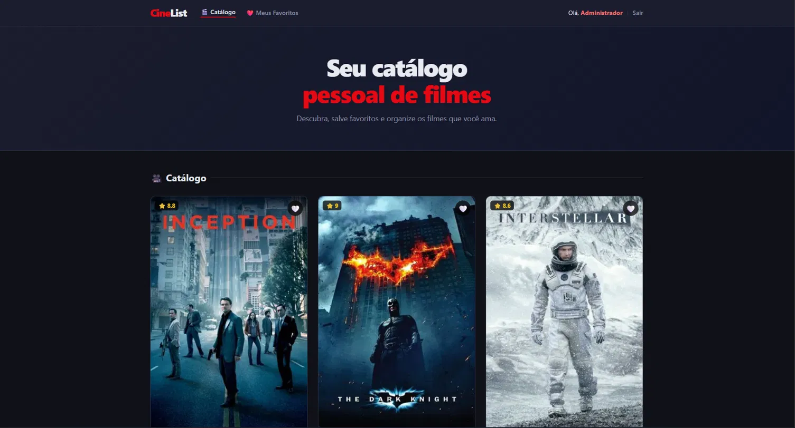
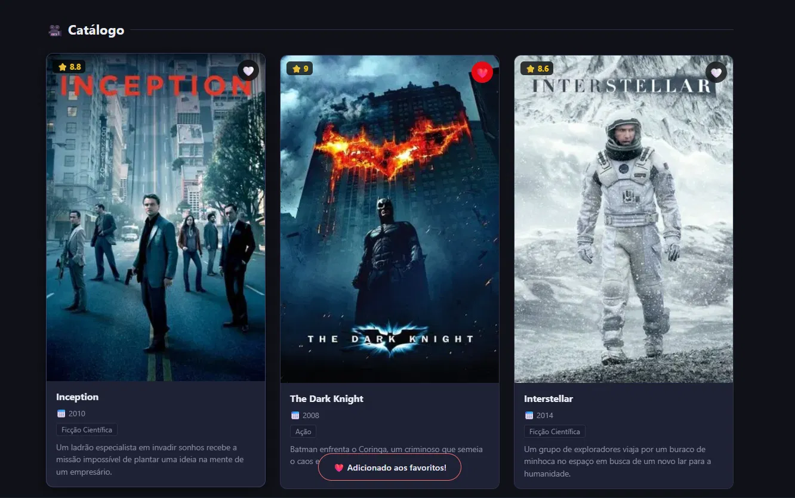

# CineList – Catálogo de Filmes com Favoritos

**Atividade Prática – Login + Personalização**

---

## Informações do Aluno

- **Nome:** [Seu Nome Aqui]
- **Matrícula:** [Sua Matrícula Aqui]

---

## Descrição do Projeto

Aplicação web de catálogo de filmes com sistema de login integrado e funcionalidade de favoritos personalizada por usuário.

A entidade principal do projeto é **Filmes**, gerenciada via JSON Server.

---

## Como Executar

1. Instale o JSON Server (caso não tenha):
   ```bash
   npm install -g json-server
   ```

2. Na raiz do projeto, inicie o servidor:
   ```bash
   json-server --watch db.json --port 3000
   ```

3. Abra `http://localhost:3000` no navegador ou use a extensão Live Server apontando para a porta 3000.

> **Usuários de teste:**
> - Login: `admin` | Senha: `123`
> - Login: `user` | Senha: `123`

---

## Funcionalidades Implementadas

### ✅ Integração do Módulo de Login
- Script `login.js` incluído na `index.html`
- Ao carregar a home, verifica sessão via `sessionStorage`
- Se não logado, redireciona para `/modulos/login/index.html`
- Header exibe "Olá, [nome] | Sair" quando logado, ou link "Entrar"

### ✅ Favoritos por Usuário
- Botão ❤️ em cada card do catálogo
- Se não logado: exibe aviso e redireciona para login
- Se logado: alterna favorito e salva em `localStorage` com chave `favoritos_<idUsuario>`
- Estado visual persiste ao recarregar a página
- Cada usuário tem sua própria lista independente

### ✅ Página "Meus Favoritos"
- Rota: `/modulos/favoritos/index.html`
- Lista apenas os filmes favoritados pelo usuário logado
- Permite desfavoritar diretamente da lista
- Estado vazio com CTA para o catálogo

---

## Estrutura de Arquivos

```
projeto/
├── index.html                    # Home-page (catálogo)
├── db.json                       # Banco de dados (JSON Server)
├── assets/
│   ├── css/
│   │   └── style.css            # Estilos globais
│   └── js/
│       ├── login.js             # Módulo de login (fornecido)
│       ├── favoritos.js         # Módulo de favoritos
│       └── app.js               # Lógica da home
└── modulos/
    ├── login/
    │   └── index.html           # Formulário de login
    └── favoritos/
        └── index.html           # Página Meus Favoritos
```

---

## Prints

> *(Adicione aqui os prints solicitados)*

### Home com usuário logado ("Olá, …")


### Funcionalidade de favoritos


### Página "Meus Favoritos"


---

## Decisões Técnicas

| Dado | Armazenamento | Justificativa |
|---|---|---|
| Sessão do usuário | `sessionStorage` | Expira ao fechar o navegador (segurança) |
| Favoritos | `localStorage` | Persiste entre sessões, isolado por usuário via chave composta |
| Dados de usuários e filmes | JSON Server | Simula API REST para dados dinâmicos |
